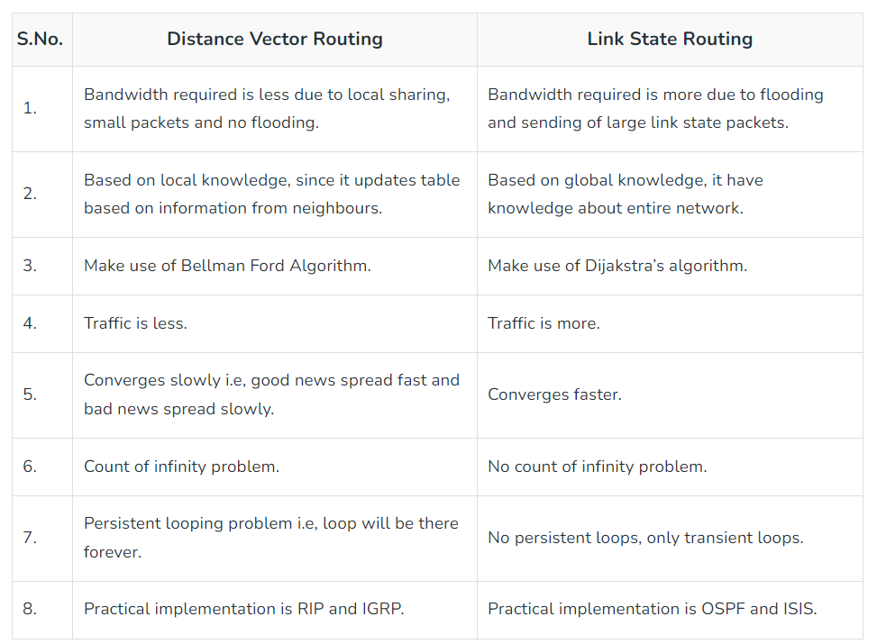
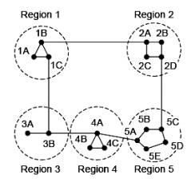
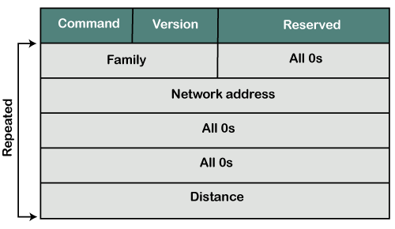
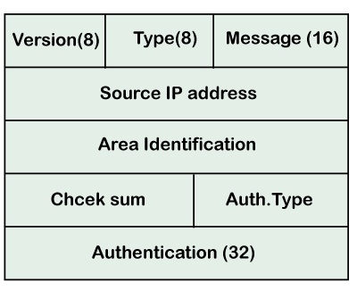

# Unit 1

## Routing

Routing is the process of forwarding the packets from source to the destination.

### Hop Count

Hop count is the number of routers occurring in between the source and destination network that the packet has to pass through.

The path with the lowest hop count is considered as the best route to reach a network and therefore placed in the routing table.

## Routing Algorithims

A routing algorithm is a procedure that lays down the route or path to transfer data packets from source to the destination.

They help in directing Internet traffic efficiently.

After a data packet leaves its source, it can choose among the many different paths to reach its destination. Routing algorithm mathematically computes the best path, i.e., “least – cost path” that the packet can be routed through.

The routing algorithms can be classified as follows:

1. Dynamic Algorithms
2. Static Algorithms
3. Hybrid Algorithms

### Dynamic Algorithms

Also known as Adaptive Algrotihims.

Dynamic algorithims makes routing decisions dynamically depending on the network conditions.

These algorithms change their routing decisions whenever a change in the network occurs, like topology or traffic load changes.

They make use of dynamic information such as current topology, load, delay, etc. to select routes.

These can be classified into three types:

1. Isolated Algorithims
2. Centralized Algorithims
3. Distributed Algorithims

#### Isolated Algorithims

In this method each, node makes its routing decisions using the information it has without seeking information from other nodes.

The disadvantage is that packets may be sent through a congested network which may result in delay.

Examples: Hot potato routing, and backward learning.

#### Centralized Algorithims

Also known as Global Routing Algorithims.

In this method, a centralized node has entire information about the network and makes all the routing decisions.

The advantage of this is that only one node is required to keep the information of the entire network.

The disadvantage is that if the central node goes down the entire network is down as well.

Example: Link State Algorithim.

#### Distributed Algorithims

Also known as Decentralized Algorithims.

In this method, the node receives information from its neighbors and then takes the decision about routing the packets.

These computes the least-cost path between source and destination in an iterative and distributed manner.

In these algorithms, no node has the knowledge about the cost of all the network links. In the beginning, a node contains the information only about its own directly attached links and through an iterative process of calculation computes the least-cost path to the destination.

Example: Distance Vector Algorithim.

### Static Algorithms

Also known as Non-Adaptive Algrotihims.

These are the algorithms that do not change their routing decisions once they have been selected.

The route to be taken is computed in advance and downloaded to routers when a router is booted.

These can be classified into two types:

1. Flooding
2. Random Walk

#### Flooding

This adapts the technique in which every incoming packet is sent on every outgoing line except from which it arrived.

One problem with this is that packets may go in a loop and as a result of which a node may receive duplicate packets. These problems can be overcome with the help of sequence numbers, hop count, and spanning trees.

#### Random Walk

In this method, packets are sent host by host or node by node to one of its neighbors randomly.

This is a highly robust method that is usually implemented by sending packets onto the link which is least queued.

### Hybrid Algorithms

These algorithms are a combination of both adaptive and non-adaptive algorithms.
 
In this approach, the network is divided into several regions, and each region uses a different algorithm.

These are classified into two types:

1. Link State Algorithims
1. Distance Vector Algorithims

#### Link State Algorithim

Link state routing is a technique in which each router shares the knowledge of its neighbourhood with every other router.

It uses link-state routers to exchange messages that allow each router to learn the entire network topology. Based on this learned topology, each router is then able to compute its routing table by using the shortest path computation.

The three keys to understand the link state routing algorithm are:

1. **Knowledge about the neighbourhood**
    
    Instead of sending its routing table, a router sends the information about its neighbourhood only.

2. **Flooding**
    
    Each router sends the information to every other router on the internetwork except its neighbours. This process is known as flooding. Every router that receives the packet sends the copies to all the neighbours. Finally, each and every router receives a copy of the same information.

3. **Information Sharing**
    
    A router send the information to every other router only when the change occurs in the information.

**Phases:**

1. **Reliable Flooding**
    
    In initial state each node knows the cost of its neighbours.
    
    In final state each node knows cost for the entire graph.

2. **Route Calculation**
    
    Each node uses Dijkstra’ s algorithm on the graph to calculate the optimal routes to all nodes.

**Path Calculation:**

To find the shortest path, each node needs to run the Dijkstra algorithm.

**Characterstics:**

- Requires a large amount of memory.

- Shortest path computation requires many cpu cycles.

- All neighbours must be trusted in the topology.

**Protocols:**

- OSPF (Open Shortest Path First)

- IS-IS (Intermediate System to Intermediate System)

**Problems:**

- Heavy traffic due to flooding of packets.

- Flooding can result in infinite looping which can be solved by using the time to live field.

#### Distance Vector Algorithim

It uses UDP for transportation.

This algorithm is iterative, asynchronous and distributed.

**Distributed:** It is distributed in that each node receives information from its directly attached neighbours, performs calculation and then distributes the result back to its neighbours.

**Iterative:** It is iterative in that its process continues until no more information is available to be exchanged between neighbours.

**Asynchronous:** It does not require that all of its nodes operate in the lock step with each other.

Three Keys to understand the working are:

- **Knowledge about the whole network**
    
    Each router shares its knowledge through the entire network.
    
    The Router sends its collected knowledge about the network to its neighbours.

- **Routing only to neighbours**
    
    The router sends its knowledge about the network to only those routers which have direct links. The router sends whatever it has about the network through the ports. The information is received by the router and uses the information to update its own routing table.
    
- **Information sharing at regular intervals**
    
    Within 30 seconds, the router sends the information to the neighbouring routers.

**Advantages:**

- It is simpler to configure and maintain than link state routing.

**Disadvantages:**

- It is slower to converge than link state.

- It is at risk from the count-to-infinity problem.

- It creates more traffic than link state since a hop count change must be propagated to all routers and processed on each router. Hop count updates take place on a periodic basis, even if there are no changes in the network topology, so bandwidth-wasting broadcasts still occur.

- For larger networks, distance vector routing results in larger routing tables than link state since each router must know about all other routers. This can also lead to congestion on WAN links.

**Problems:**

- Count to infinity problem which can be solved by splitting horizon.

- Good news spread fast and bad news spread slowly.

- Persistent looping problem i.e., loop will be there forever.

#### Distance Vector vs Link-State Routing

## Heirarchical Routing

In hierarchical routing, routers are classified in groups called regions. Each router has information about the routers in its own region and it has no information about routers in other regions.

So, routers save one record in their table for every other region.

For huge networks, a two-level hierarchy may be insufficient hence, it may be necessary to group the regions into clusters, the clusters into zones, the zones into groups and so on.

## RIP

RIP stands for Routing Information Protocol.

IP is a distance-vector routing protocol that uses hop count as a routing metric to find the best path between the source and the destination network.

It has an AD value of 120 and works on the network layer of the OSI model.

RIP uses port number 520.

RIP prevents routing loops by limiting the number of hops allowed in a path from source and destination.

The maximum hop count allowed for RIP is 15 and a hop count of 16 is considered as network unreachable.

###### Features

- Updates of the network are exchanged preiodically.

- Updates are always shared as broadcast.

- Full routing tables are sent in updates.

- Routers always trust routing information received from neighbor routers. This is also known as Routing on rumors.

###### RIP Versions

**RIP v1**

Sends updates as broadcast.

Broadcast at 255.255.255.255.

Doesn't supports authentication of updated messages.

Classful routing protocol.

**RIP v2**

Sends updates as multicast.

Multicast at 224.0.0.9.

Supports authentication of RIPv2 update messages.

Classfull and classless updates are sent.

**RIPng**

Sends updates as multicast.

RIPng can only run on IPv6 networks.

Classless updates are sent.

###### Message Format

**Command:** It is an 8-bit field that is used for request or reply. The value
of the request is 1, and the value of the reply is 2.

**Version:** Here, version means that which version of the protocol we are using. Suppose we are using the protocol of version1, then we put the 1 in this field.

**Reserved:** This is a reserved field, so it is filled with zeroes.

**Family:** It is a 16-bit field. As we are using the TCP/IP family, so we put 2 value in this field.

**Network Address:** It is defined as 14 bytes field. If we use the IPv4 version, then we use 4 bytes, and the other 10 bytes are all zeroes.

**Distance:** The distance field specifies the hop count, i.e., the number of hops used to reach the destination.

###### Advantages

**Simplicity:** RIP is a relatively simple protocol to configure and manage, making it an ideal choice for small to medium-sized networks with limited resources.

**Easy implementation:** RIP is easy to implement, as it does not require much technical expertise to set up and maintain.

**Compatibility:** RIP is compatible with many different types of routers and network devices, making it easy to integrate into existing networks.

**Automatic updates:** RIP automatically updates routing tables at regular intervals, ensuring that the most up-to-date information is being used to route packets.

###### Disadvantages

**Limited scalability:** RIP has limited scalability, and it may not be the best choice for larger networks with complex topologies. RIP can only support up to 15 hops, which may not be sufficient for larger networks.

**Routing loops:** RIP can sometimes create routing loops, which can cause network congestion and reduce overall network performance.

**Security vulnerabilities:** RIP does not provide any native security features, making it vulnerable to attacks such as spoofing and tampering.

**Limited support for load balancing:** RIP does not support sophisticated load balancing, which can result in suboptimal routing paths and uneven network traffic distribution.

## OSPF Protocol

OSPF stands for Open Shortest Path First.

Open Shortest Path First (OSPF) is a link-state routing protocol that is used to find the best path between the source and the destination.

It is an intradomain routing protocol.

It is developed by Internet Engineering Task Force (IETF).

It is a network layer protocol which works on protocol number 89 and uses AD value 110.

###### Working

**Step 1:** The first step is to become OSPF neighbors. The two connecting routers running OSPF on the same link creates a neighbor relationship.

**Step 2:** The second step is to exchange database information. After becoming the neighbors, the two routers exchange the LSDB information with each other.

**Step 3:** The third step is to choose the best route. Once the LSDB (Link State Database) information has been exchanged with each other, the router chooses the best route to be added to a routing table based on the calculation of SPF.

###### Links

There are four types of links in OSPF:

**Point-to-point link:** The point-to-point link directly connects the two routers without any host or router in between.

**Transient link:** When several routers are attached in a network, they are known as a transient link.

**Stub link:** It is a network that is connected to the single router. Data enters to the network through the single router and leaves the network through the same router.

**Virtual link:** If the link between the two routers is broken, the administration creates the virtual path between the routers, and that path could be a long one also.

###### Message Format

**Version:** It is an 8-bit field that specifies the OSPF protocol version.

**Type:** It is an 8-bit field. It specifies the type of the OSPF packet.

**Message:** It is a 16-bit field that defines the total length of the message, including the header. Therefore, the total length is equal to the sum of the length of the message and header.

**Source IP address:** It defines the address from which the packets are sent. It is a sending routing IP address.

**Area identification:** It defines the area within which the routing takes place.

**Checksum:** It is used for error correction and error detection.
Authentication type: There are two types of authentication, i.e., 0 and 1. Here, 0 means for none that specifies no authentication is available and 1 means for pwd that specifies the password-based
authentication.

**Authentication:** It is a 32-bit field that contains the actual value of the authentication data.

## BGP

BGP stands for Border Gateway Protocol.

It is an inter-domain routing protocol.

It uses path vector routing.

It runs over TCP.

The protocol that is running on the internet or used to communicate
between two different autonomous number systems is known as BGP

###### Features

**Open Standard**: It is a standard protocol which can run on any device.

**Exterior Gateway Protocol**: It is an exterior gateway protocol that is used to exchange the routing information between two or more autonomous system numbers.

**Supports Internet**: It is the only protocol that operates on the internet backbone.

It is a classless protocol.

Supports incremental and trigger updates.

**Path Vector Protocol**: The BGP is a path vector protocol. Here, path vector is a method of sending the routes along with routing information.

**Application Layer Protocol**: It is an application layer protocol and uses TCP protocol for reliability.

