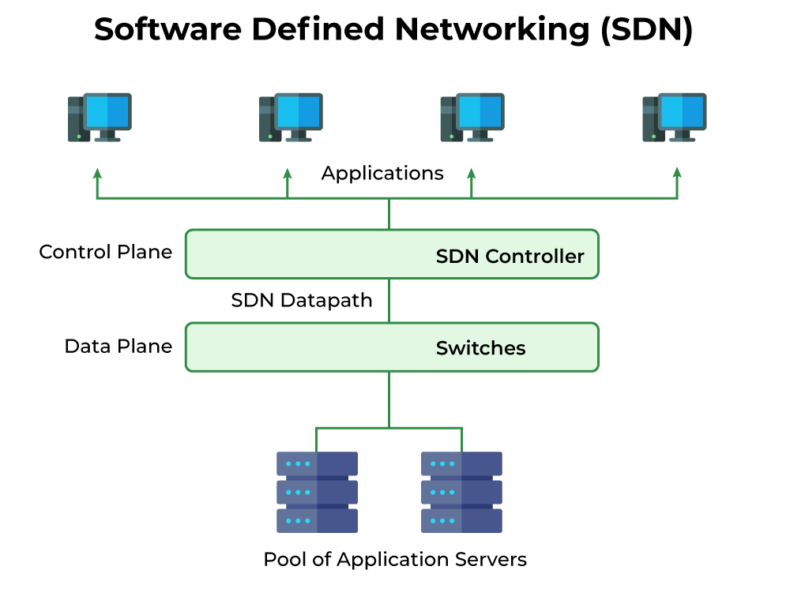

# Unit 4

## SDN

SDN stands for Software Defined Network.

It is a networking architecture approach which enables the control and management of the network using software applications.

Through SDN networking behavior of the entire network and its devices are programmed in a centrally controlled manner through software applications using open APIs.

SDN is divided into two planes:

1. Data Plane
1. Control Plane

### Data Plane

All the activities involving as well as resulting from data packets sent by the end-user belong to this plane.

This includes:

- Forwarding of packets.
- Segmentation and reassembly of data.
- Replication of packets for multicasting.

### Control Plane

All activities necessary to perform data plane activities that do not involve end-user data packets belong to this plane.

In other words, this is the brain of the network.

This includes:

- Making routing tables.
- Setting packet handling policies.

### Components

The three main components that make the SDN are:

1. Applications
2. Controller
3. Networking Devices

### Architecture

### Traditional vs Software Defined Networking

| **Software Defined Networking** | **Traditional Networking** |
| ---- | ---- |
| Software Defined Network is a virtual networking approach. | A traditional network is the old conventional networking approach. |
| Software Defined Network is centralized control. | Traditional Network is distributed control. |
| This network is programmable. | This network is nonprogrammable. |
| Software Defined Network is the open interface. | A traditional network is a closed interface. |
| In Software Defined Network data plane and control, the plane is decoupled by software. | In a traditional network data plane and control plane are mounted on the same plane. |
|  |  |