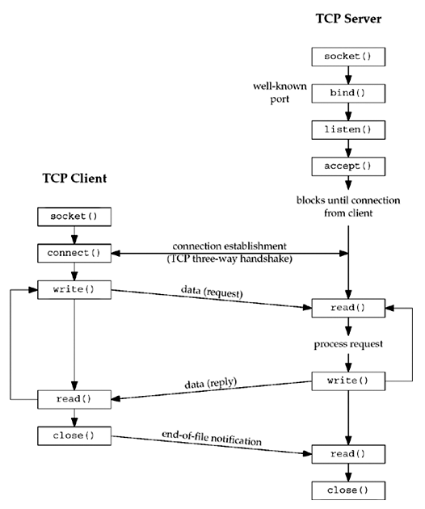

# Unit 5



## Socket Address Structure

###### Posix Definition

```c
struct in_addr {
  in_addr_t s_addr; // 32 bit IPv4 network byte ordered address
};

struct sockaddr_in {
  uint8_t sin_len; // length of structure (16)
  sa_family_t sin_family; // AF_INET
  in_port_t sin_port; // 16 bit TCP or UDP port number
  struct in_addr sin_addr; // 32 bit IPv4 address
  char sin_zero[8]; // not used but always set to zero
};
```

###### Generic Definition

```c
struct sockaddr {
  uint8_t sa_len;
  sa_family_t sa_family; // address family: AD_xxx value
  char sa_data[14]; // unused data to complete size requirements
};
```

### Byte Order

Different cpu architectures use different byte orders, little-endian and big-endian. But the network protocols work on a specific byte order.

The byte order of the host architecture is called host byte byte order.

The byte order used by the network protocol is called network byte order.

To perform conversions between host and network byte order, following functinos are used.

```c
#include <netinet/in.h>

// host to network short
uint16_t htons(uint16_t host16bitvalue);

// host to network long
uint32_t htonl(uint32_t host16bitvalue);

// network to host short
uint16_t ntohs(uint16_t host16bitvalue);

// network to host long
uint32_t ntohl(uint32_t host16bitvalue);
```

### TCP Connection Procedure

Steps for establishing a connection on the client side are:

- Create a socket using the socket() function.
- Connect the socket to the address of the server using the connect() function.
- Send and receive data by means of the read() and write() functions.

Steps for establishing a connection on the server side are:

- Create a socket with the socket() function.
- Bind the socket to an address using the bind() function.
- Listen for connections with the listen() function.
- Accept a connection with the accept() function system call. This call typically blocks until a client connects with the server.
- Send and receive data by means of send() and receive().

### Functions

###### `socket` function

```c
#include "sys/socket.h"

///
/// # Returns
/// 
/// A non negative integer representing socket descriptor, or -1 on error.
int socket(int family, int type, int protocol);
```

###### `connect` function

```c
#include "sys/socket.h"

/// Establishes a connection with a tcp server.
/// 
/// # Parameters
/// 
/// - `sockfd`: The socket descriptor returned by the socket function.
/// 
/// # Returns
/// 
/// 0 if connection is established, else -1.
int connect(int sockfd, cosnt struct sockaddr* servaddr, socklen_t addrlen);
```

###### `bind` function

```c
#include "sys/socket.h"

/// 
/// 
int bind(int sockfd, const struct sockaddr* servaddr, socklen_t addrlen);
```