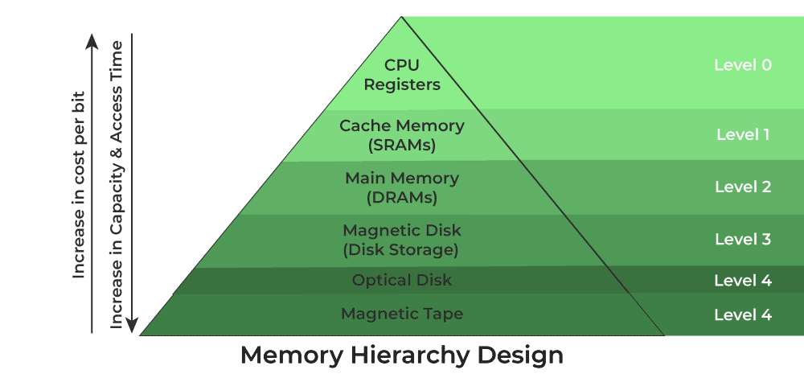

# Unit 2

## Memory Heirarchy

It is the organization of different types memory based on their characterstics.

These characterstics could be price, performance, storage, lifetime.

The char can be divided into two types:

1. Internal Memory
    
    Also known as primay memory.
    
    Comprising of Main Memory, Cache Memory & CPU registers. This is directly accessible by the processor.

2. External Memory
    
    Also known as secondary memory.
    
    Comprising of Magnetic Disk, Optical Disk, Magnetic Tape i.e. peripheral storage devices which are accessible by the processor via I/O Module.

The chart can be ordered using these characterstics:

1. Capacity
2. Access Time
3. Bandwidth
4. Cost per Bit

## Cache Coherence

Cache coherence refers to the consistency and synchronization of data stored in different caches within a multiprocessor system.

###### Example

Suppose there are three processors, each having cache. Suppose the following scenario:-

- **Processor 1 read X :** obtains 24 from the memory and caches it.
- **Processor 2 read X :** obtains 24 from memory and caches it.
- **Again, processor 1 writes as X :** 64, Its locally cached copy is updated. Now, processor 3 reads X, what value should it get?
- Memory and processor 2 thinks it is 24 and processor 1 thinks it is 64.

###### Protocols

1. MSI protocol (Modified, Shared, Invalid)
2. MOSI protocol (Modified, Owned, Shared, Invalid)
3. MESI protocol (Modified, Exclusive, Shared, Invalid)
4. MOESI protocol (Modified, Owned, Exclusive, Shared, Invalid)

These important terms are discussed as follows:

- **Modified**
    
    It means that the value in the cache is dirty, that is the value in current cache is different from the main memory.

- **Exclusive**
    
    It means that the value present in the cache is same as that present in the main memory, that is the value is clean.

- **Shared**
    
    It means that the cache value holds the most recent data copy and that is what shared among all the cache and main memory as well.

- **Owned**
    
    It means that the current cache holds the block and is now the owner of that block, that is having all rights on that particular blocks.

- **Invalid**
    
    This states that the current cache block itself is invalid and is required to be fetched from other cache or main memory.

###### Mechanisms

1. **Directory Based**
    
    In a directory-based system, the data being shared is placed in a common directory that maintains the coherence between caches. The directory acts as a filter through which the processor must ask permission to load an entry from the primary memory to its cache. When an entry is changed, the directory either updates or invalidates the other caches with that entry.

2. **Snooping**
    
    First introduced in 1983, snooping is a process where the individual caches monitor address lines for accesses to memory locations that they have cached. It is called a write invalidate protocol. When a write operation is observed to a location that a cache has a copy of and the cache controller invalidates its own copy of the snooped memory location.

3. **Snarfing**
    
    It is a mechanism where a cache controller watches both address and data in an attempt to update its own copy of a memory location when a second master modifies a location in main memory. When a write operation is observed to a location that a cache has a copy of the cache controller updates its own copy of the snarfed memory location with the new data.

## Locality of Reference

It refers to a phenomenon in which a computer program tends to access same set of memory locations for a particular time period.

The property of locality of reference is mainly shown by loops and subroutine calls in a program.

###### Cache Operation

It is based on the principle of locality of reference. There are two ways with which data or instruction is fetched from main memory and get stored in cache memory. These two ways are the following:

1. **Temporal Locality**
    
    Temporal locality means current data or instruction that is being fetched may be needed soon. So we should store that data or instruction in the cache memory so that we can avoid again searching in main memory for the same data.

2. **Spatial Locality**
    
    Spatial locality means instruction or data near to the current memory location that is being fetched, may be needed soon in the near future.

###### Spatial Locality and Temporal Locality

1. In Spatial Locality, nearby instructions to recently executed instruction are likely to be executed soon.
    
    In Temporal Locality, a recently executed instruction is likely to be executed again very soon.

2. It refers to the tendency of execution which involve a number of memory locations.
    
    It refers to the tendency of execution where memory location that have been used recently have a access.

3. It is also known as locality in space.
    
    It is also known as locality in time.

4. It only refers to data item which are closed together in memory.
    
    It repeatedly refers to same data in short time span.

5. Each time new data comes into execution.
    
    Each time same useful data comes into execution.

6. Example: Data elements accessed in array (where each time different (or just next) element is being accessing).
    
    Example: Data elements accessed in loops (where same data elements are accessed multiple times).

###### Cache Performance

The performance of the cache is measured in terms of hit ratio.

**Cache Hit**: When CPU refers to memory and find the data or instruction within the cache memory, it is known as cache hit.

**Cache Miss**: If the desired data or instruction is not found in the cache memory and CPU refers to the main memory to find that data or instruction, it is known as a cache miss.

We can improve Cache performance using higher cache block size, higher associativity, reduce miss rate, reduce miss penalty, and reduce the time to hit in the cache.

##### Cache Mapping

There are three different types of mapping used for the purpose of cache memory which is as follows:

- Direct Mapping
- Associative Mapping
- Set-Associative Mapping

###### Direct Mapping

The simplest technique, known as direct mapping, maps each block of main memory into only one possible cache line. or In Direct mapping, assign each memory block to a specific line in the cache. If a line is previously taken up by a memory block when a new block needs to be loaded, the old block is trashed. An address space is split into two parts index field and a tag field. The cache is used to store the tag field whereas the rest is stored in the main memory. Direct mapping's performance is directly proportional to the Hit ratio.

###### Associative Mapping

In this type of mapping, associative memory is used to store the content and addresses of the memory word. Any block can go into any line of the cache. This means that the word id bits are used to identify which word in the block is needed, but the tag becomes all of the remaining bits. This enables the placement of any word at any place in the cache memory. It is considered to be the fastest and most flexible mapping form. In associative mapping, the index bits are zero.

###### Set Associative Mapping

This form of mapping is an enhanced form of direct mapping where the drawbacks of direct mapping are removed. Set associative addresses the problem of possible thrashing in the direct mapping method. It does this by saying that instead of having exactly one line that a block can map to in the cache, we will group a few lines together creating a _**set**_.

#### Cache optimization Techniques

Optimization of cache performance ensures that it is utilized in a very efficient manner.

###### AMAT

AMAT stands for Average Memory Access Time.

AMAT helps in analyzing the cache memory and its performance. The lesser the AMAT, the better the performance is.

AMAT can be calculated as,
AMAT = Hit Ratio * Cache access time + Miss Ratio * Main memory access time
=> (h * tc) + (1-h) * (tc + tm)

**Example 1:** What is the average memory access time for a machine with a cache hit rate of 75% and cache access time of 3 ns and main memory access time of 110 ns.

**Solution:**
Average Memory Access Time(AMAT) = = (h * tc) + (1-h) * (tc + tm)
Given,
Hit Ratio(h) = 75/100 = 3/4 = 0.75
Miss Ratio (1-h) = 1-0.75 = 0.25
Cache access time(tc) = 3ns
Main memory access time(effectively) = tc + tm = 3 + 110 = 113 ns
Average Memory Access Time(AMAT) = (0.75 * 3) + (0.25 * (3+110))
= 2.25 + 28.25
= 30.5 ns

## Virtual Memory

It is a storage allocation scheme in which secondary memory is treated as primary memory.

It is implemented using two methods:

1. Demand Paging
2. Demand Segmentation

##### Demand Paging

The process of loading the page into memory on demand (whenever a page fault occurs) is known as demand paging.

The process includes the following steps are as follows:

1. If the CPU tries to refer to a page that is currently not available in the main memory, it generates an interrupt indicating a memory access fault.

2. The OS puts the interrupted process in a blocking state. For the execution to proceed the OS must bring the required page into the memory.

3. The OS will search for the required page in the logical address space.

4. The required page will be brought from logical address space to physical address space. The page replacement algorithms are used for the decision-making of replacing the page in physical address space.

5. The page table will be updated accordingly.

6. The signal will be sent to the CPU to continue the program execution and it will place the process back into the ready state.

**Page Fault Time**: The time taken to complete all the above steps.

###### Advantages

- More processes may be maintained in the main memory.

- Very Large Process
    
    A process larger than the main memory can be executed because of demand paging. The OS itself loads pages of a process in the main memory as required.

- It makes it possible to run more applications at once.

- Memory allocation is comparatively cheap.

- Users are spared from having to add memory modules when ram space runs out

- Memory isolation has increased security.

- It makes it possible for several larger applications to run at once.

###### Disadvantages

- It can slow down the system performance, as data needs to be constantly transferred between the physical memory and the hard disk.

- It can increase the risk of data loss or corruption, as data can be lost if the hard disk fails or if there is a power outage while data is being transferred to or from the hard disk.

- It can increase the complexity of the memory management system, as the operating system needs to manage both physical and virtual memory.

##### Swapping

It is the process of moving a process between primary memory and virtual memory.

Example: suspending or resuming a process.

##### Thrashing

It is the situation when the os is busy swapping process, and cannot give enough time to actually execute the process.

This could happen because of low memory space remaining in primary memory.

###### Causes

- High Degree of Multiprogramming
    
    If the number of processes keeps on increasing in the memory then the number of frames allocated to each process will be decreased. So, fewer frames will be available for each process. Due to this, a page fault will occur more frequently

- Lacks of Frames
    
    If a process has fewer frames then fewer pages of that process will be able to reside in memory and hence more frequent swapping in and out will be required.

###### Recovery

- Do not allow the system to go into thrashing by instructing the long-term scheduler not to bring the processes into memory after the threshold.

- If the system is already thrashing then instruct the mid-term scheduler to suspend some of the processes so that we can recover the system from thrashing.