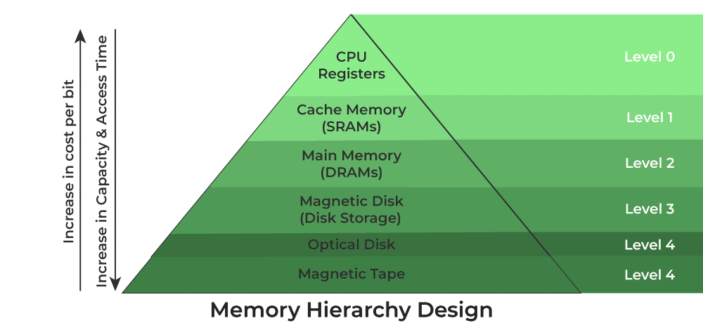

# Unit 2

## Memory Heirarchy

It is the organization of different types memory based on their characterstics.

These characterstics could be price, performance, storage, lifetime.

The char can be divided into two types:

1. Internal Memory
    
    Also known as primay memory.
    
    Comprising of Main Memory, Cache Memory & CPU registers. This is directly accessible by the processor.

2. External Memory
    
    Also known as secondary memory.
    
    Comprising of Magnetic Disk, Optical Disk, Magnetic Tape i.e. peripheral storage devices which are accessible by the processor via I/O Module.

The chart can be ordered using these characterstics:

1. Capacity
2. Access Time
3. Bandwidth
4. Cost per Bit

## Cache Coherence

Cache coherence refers to the consistency and synchronization of data stored in different caches within a multiprocessor system.

###### Example

Suppose there are three processors, each having cache. Suppose the following scenario:-

- **Processor 1 read X :** obtains 24 from the memory and caches it.
- **Processor 2 read X :** obtains 24 from memory and caches it.
- **Again, processor 1 writes as X :** 64, Its locally cached copy is updated. Now, processor 3 reads X, what value should it get?
- Memory and processor 2 thinks it is 24 and processor 1 thinks it is 64.

###### Protocols

1. MSI protocol (Modified, Shared, Invalid)
2. MOSI protocol (Modified, Owned, Shared, Invalid)
3. MESI protocol (Modified, Exclusive, Shared, Invalid)
4. MOESI protocol (Modified, Owned, Exclusive, Shared, Invalid)

These important terms are discussed as follows:

- **Modified**
    
    It means that the value in the cache is dirty, that is the value in current cache is different from the main memory.

- **Exclusive**
    
    It means that the value present in the cache is same as that present in the main memory, that is the value is clean.

- **Shared**
    
    It means that the cache value holds the most recent data copy and that is what shared among all the cache and main memory as well.

- **Owned**
    
    It means that the current cache holds the block and is now the owner of that block, that is having all rights on that particular blocks.

- **Invalid**
    
    This states that the current cache block itself is invalid and is required to be fetched from other cache or main memory.

###### Mechanisms

1. **Directory Based**
    
    In a directory-based system, the data being shared is placed in a common directory that maintains the coherence between caches. The directory acts as a filter through which the processor must ask permission to load an entry from the primary memory to its cache. When an entry is changed, the directory either updates or invalidates the other caches with that entry.

2. **Snooping**
    
    First introduced in 1983, snooping is a process where the individual caches monitor address lines for accesses to memory locations that they have cached. It is called a write invalidate protocol. When a write operation is observed to a location that a cache has a copy of and the cache controller invalidates its own copy of the snooped memory location.

3. **Snarfing**
    
    It is a mechanism where a cache controller watches both address and data in an attempt to update its own copy of a memory location when a second master modifies a location in main memory. When a write operation is observed to a location that a cache has a copy of the cache controller updates its own copy of the snarfed memory location with the new data.

## Locality of Reference

It refers to a phenomenon in which a computer program tends to access same set of memory locations for a particular time period.

The property of locality of reference is mainly shown by loops and subroutine calls in a program.

