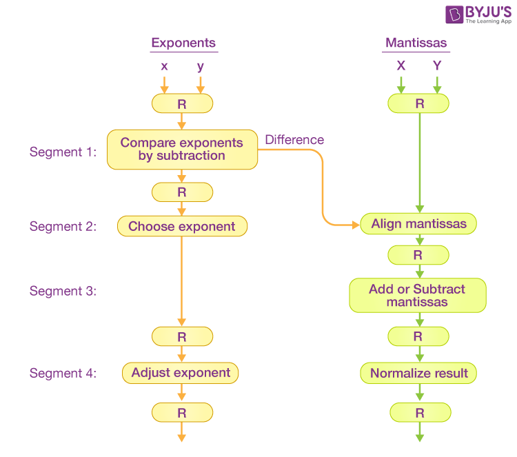
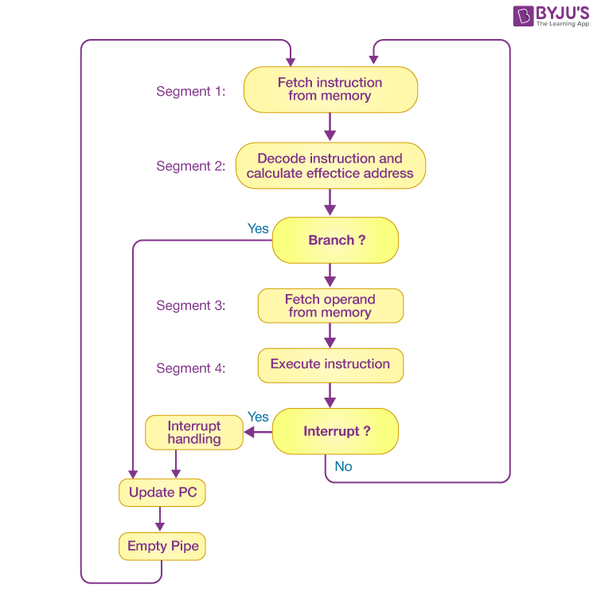
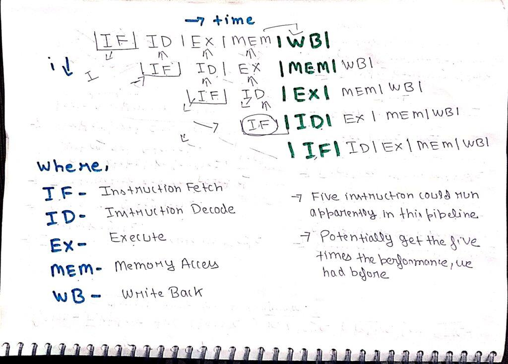

# Unit 3

## Pipelining

Pipelining is the technique of decomposing a sequential process into sub-operations, with every sub-operation being executed concurrently in a dedicated segments.

In general, the pipeline organization is applicable for two areas of computer design:

1. Arithmetic Pipeline
2. Instruction Pipeline

### Arithmetic Pipeline

When pipelining technique is applied on an arithmetic operation, it's called arithmetic pipelining.

---

##### Example

We perform addition and subtraction of floating points on a unit of the pipeline here.

```
A = X * 2x = 0.9504 * 103
B = Y * 2y = 0.8200 * 102
```

where X and Y refers to the mantisa and x and y refers to exponents.



###### Segment 1

The difference between the exponents is calculated by subtracting them. The result’s exponent is chosen to be the larger exponent.

###### Segment 2

As per the difference of exponents calculated in segment one, the mantissa corresponding with the smaller exponent would be moved.

```
A = 0.9504 * 103
B = 0.08200 * 103
```

###### Segment 3

Both the mantissa would be added in the third segment.

```
C = A + B = 1.0324 * 103
```

###### Segment 4

After the process of normalization, the result would be written as follows:

```
C = 0.1324 * 104
```

---

### Instruction Pipeline

When pipelining technique is applied on the instruction stream, it's called instruction pipelining.

---

##### Example

In general, each and every instruction must be processed by the computer in the following order:

1. Fetching the instruction from memory

2. Decoding the obtained instruction

3. Calculating the effective address

4. Fetching the operands from the given memory

5. Execution of the instruction

6. Storing the result in a proper place

Each step is carried out in its own segment. Generally a 4 segment approach is used.



###### Segment 1

The implementation of the instruction fetch segment can be done using the FIFO or first-in, first-out buffer.

###### Segment 2

In the second segment, the memory instruction is decoded, and the effective address is then determined in a separate arithmetic circuit.

###### Segment 3

In the third segment, some operands would be fetched from memory.

###### Segment 4

The instructions would finally be executed in the very last segment of a pipeline organisation.

---

## RISC-V

RISC-V is an open source implementation of reduced instruction set computing based instruction set architecture.

It was designed by researchers at UC Berkely in 2010.

Most ISAs like X86, ARM, Power, MIPS, SPARC are commercially protected by patents. Thus preventing practical efforts to reproduce the computer systems. But RISC-V is open and allows any person or group to construct compaitible computers.

### Goals

- A completely open ISA that is freely available to academia and industry.

- A real ISA suitable for direct native hardware implementation, not just simulation or binary translation.

- Support for IEEE 754 floating point standard.

- Supports Base Integer ISA.

- Suppors optional standard extensions.

- Suppors optional custom extensions.

### Principles

- Simple and extendable.

- Separated into multiple specifications:
    - user level isa (compute instructions)
    - compressed isa (16 bit instructions)
    - priviliged isa (supervisor mode instructions)
    - ...

- ISA support is given by RV + word-width + extensions
    
    For Example, RV32I means 32-bit RISC-V with support for the Integer instruction set

### User Level ISA

Defines the normal instructions needed for computation.

It includes:

- A mandatory Base Integer ISA
    - I: Integer Instructions

- Standard Extensions
    - M: Integer multiplication and division
    - A: Atomic instructions
    - F: Single precision floating point
    - D: Double precision floating point
    - C: Compressed instructions (16bit)
    - G: IMAFD: Integer base + four standard extensions

- Optional Custom Extensions

### 5 Stages



1. IF – Instruction Fetch – In this stage the CPU reads instructions from the address in the memory whose value is present in the program counter.

2. ID – Instruction Decode – In this stage, instruction is decoded and the register file is accessed to get the values from the registers used in the instruction.

3. EX- Execute – In this stage, ALU operations are performed.

4. MEM- Memory Access – In this stage, memory operands are read and written from/to the memory that is present in the instruction.

5. WB- Write Back – In this stage, computed/fetched value is written back to the register present in the instructions.

## Performance Issues in Pipelining

## Pipeline Hazards

Types of pipelilne hazards:

1. Structural Hazard
2. Data Hazard
3. Control Hazard

### Structural Hazard

It is the situation when more than one instruction tries to access the same resource in the same cycle.

This resources could be ALU, memory or register.

**Solution for structural dependency**

To minimize structural dependency stalls in the pipeline, we use a hardware mechanism called Renaming.

**Renaming:** According to renaming, we divide the memory into two independent modules used to store the instruction and data separately called Code memory(CM) and Data memory(DM) respectively. CM will contain all the instructions and DM will contain all the operands that are required for the instructions.

### Data Hazard

It is the situation when the execution of instruction depends on the result of another instruction that is still being processed in the pipeline.

**Solution**

To minimize data dependency stalls in the pipeline, operand forwarding is used.

**Operand Forwarding:**
In operand forwarding, we use the interface registers present between the stages to hold intermediate output so that dependent instruction can access new value from the interface register directly.

### Control Hazard

Also known as branch hazards.

It is the situation when the pipeline makes incorrect branch prediction decisions, resulting in instructions entering the pipeline that must be discarded.

#### Solutions

##### Stall
##### Prediction
##### Dynamic Branch Prediction
##### Reordering Instructions