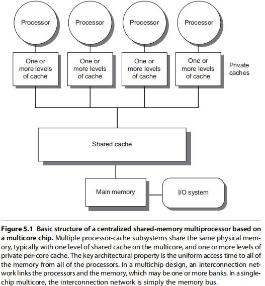
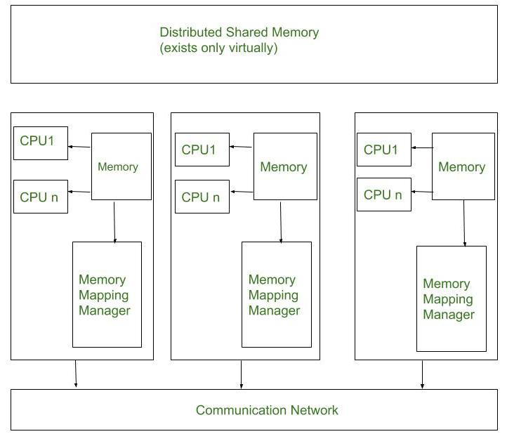

# Unit 5

## Cache Coherence

Cache coherence refers to the consistency and synchronization of data stored in different caches within a multiprocessor system.

Cache coherence problem refers to the state when multiple processors hold different value of the same memory address in their caches.

### Cache Line State

- **Modified**
    
    A cache line in this state holds the most recent, correct copy of the data while the copy in the main memory is incorrect and no other processor holds a copy.

- **Owned**
    
    A cache line in this state holds the most recent, correct copy of the data. It is similar to shared state in that other processors can hold a copy of most recent, correct data and unlike shared state however, copy in main memory can be incorrect. Only one processor can hold the data in owned state while all other processors must hold the data in shared state.

- **Exclusive**
    
    A cache line in this state holds the most recent, correct copy of the data. The main memory copy is also most recent, correct copy of data while no other holds a copy of data.

- **Shared**
    
    A cache line in this state holds the most recent, correct copy of the data. Other processors in system may hold copies of data in shared state as well. The main memory copy is also the most recent, correct copy of the data, if no other processor holds it in owned state.

- **Invalid**
    
    A cache line in this state does not hold a valid copy of data. Valid copies of data can be either in main memory or another processor cache.

### Cache Coherence Protocols

These protocols aims to solve the cache coherence problem.

#### Snoopy Bus Protocols

Snoopy Bus Protocols rely on a shared bus that connects all caches in a multiprocessor system. These protocols monitor the bus for memory transactions and employ snooping logic to maintain cache coherence. Two popular policies used in Snoopy Bus Protocols are the Write-Invalidate policy and the Write-Update policy.

1. Write-Invalidate Policy: In the Write-Invalidate policy, when a cache performs a write operation on a shared memory block, it invalidates or marks as invalid all other copies of that block in other caches. When a cache wants to read a memory block, it first checks if any other cache holds a modified copy. If so, it requests the updated data from the cache that has the latest copy or from main memory.

2. Write-Update Policy: In the Write-Update policy, when a cache performs a write operation on a shared memory block, it updates the value in its own cache and also updates all other copies of that block in other caches. This approach reduces the need for subsequent cache-to-cache transfers for read operations. However, it requires more bus bandwidth for broadcasting updates to all caches.

Snooping Logic and Broadcast Messages: Snoopy Bus Protocols rely on snooping logic implemented in each cache controller. The snooping logic monitors bus transactions to determine if a cache’s copy of a memory block is still valid or needs to be invalidated or updated. When a cache performs a write operation, it broadcasts a message on the bus to inform other caches of the change. Caches with the snooping logic update their copies accordingly.

#### Directory-Based Protocols

Directory-Based Protocols use a centralized directory to maintain cache coherence information. The directory keeps track of which caches hold copies of each memory block and manages the permissions for accessing and modifying the blocks. Two key features of Directory-Based Protocols are a common directory for maintaining coherence and permission-based data sharing.

1. Common Directory for Maintaining Coherence: In Directory-Based Protocols, a central directory maintains the coherence information for all memory blocks. It keeps track of which caches have copies of each block and their respective states (e.g., shared, modified). Caches communicate with the directory to request permission for accessing and modifying memory blocks.

2. Permission-Based Data Sharing: Directory-Based Protocols manage data sharing through permissions. When a cache wants to read or write a memory block, it requests permission from the directory. The directory grants permission based on the current state of the block and the coherence protocol in use. Caches coordinate with the directory to ensure that they have the required permissions before performing operations on shared memory blocks.

Directory-Based Protocols generally have higher overhead due to the centralized directory. However, they can provide better scalability and reduce bus contention compared to Snoopy Bus Protocols in large-scale multiprocessor systems.

## Flynn’s Classification

It is a classification scheme for computer architectures proposed by Michael Flynn in 1966.

The classification is based on the number of instruction streams and data streams that can be processed simultaneously by a computer architecture.

There are four categories in Flynn’s taxonomy:

1. SISD
2. SIMD
3. MISD
4. MIMD

##### SISD

SISD stands for Single Instruction Single Data.

This is the simplest and most common type of computer architecture.

It is easy to program and debug and can handle a wide range of applications.

However, it does not offer significant performance gains over traditional computing systems.

##### SIMD

SIMD stands for Single Instruction Multiple Data.

This type of architecture is highly parallel and can offer significant performance gains for applications that can be parallelized.

However, it requires specialized hardware and software and is not well-suited for applications that cannot be parallelized.

##### MISD

MISD stands for Multiple Instruction Single Data.

This type of architecture is not commonly used in practice, as it is difficult to find applications that can be decomposed into independent instruction streams.

##### MIMD

MIMD stands for Multiple Instruction Multiple Data.

This type of architecture is highly parallel and can offer significant performance gains for applications that can be parallelized.

It is well-suited for distributed computing, parallel processing, and other high-performance computing applications.

However, it requires specialized hardware and software and can be challenging to program and debug.

## Memory Architectures

#### Centralized Shared Memory Architecture

Also known as SMP (Symmetric Multiprocesor) architecture.

It is a type of computer system architecture where multiple processors share a common, centralized main memory.

Each processor has equal access to the entire memory address space, and they communicate with each other through a shared bus or interconnect.

Processors in an SMP system are symmetric, meaning that they have identical architectures and capabilities. Each processor has its own set of registers, cache, and execution units.

SMP systems can be scaled by adding more processors, but scalability is limited due to the contention for the shared bus or interconnect as the number of processors increases. This limitation is known as the "bus contention" problem.

#### Distributed Shared Memory Architecture

Memory is physically distributed across multiple processors. Each processesor has its own local memory, and these memories collectively form a shared address space.

This architecture provides the illusion of a single, shared address space to programs running on the system. Processes can access data stored in the local memory of other nodes as if it were in their own local memory.

Communication between nodes is typically achieved through message passing or some form of interconnect, such as a network. Nodes can read and write to the memory of other nodes by sending messages.

While DSM systems provide a shared memory view, the access times to remote memory locations may not be uniform. Accessing local memory is faster than accessing remote memory, leading to a Non-Uniform Memory Access (NUMA) characteristic.

Decentralized shared memory architectures are often more scalable than centralized shared memory architectures. As the number of nodes increases, the system can potentially scale more easily.

### Shared Memory vs Message Passing

**1. Shared Memory Model:**   
In this IPC model, a shared memory region is established which is used by the processes for data communication. This memory region is present in the address space of the process which creates the shared memory segment. The processes that want to communicate with this process should attach this memory segment into their address space. 

**2. Message Passing Model:**   
In this model, the processes communicate with each other by exchanging messages. For this purpose, a communication link must exist between the processes and it must facilitate at least two operations send (message) and receive (message). The size of messages may be variable or fixed. 

|S.No|Shared Memory Model|Message Passing Model|
|---|---|---|
|1.|The shared memory region is used for communication.|A message passing facility is used for communication.|
|2.|It is used for communication between processes on a single processor or multiprocessor systems where the communicating processes reside on the same machine as the communicating processes share a common address space.|It is typically used in a distributed environment where communicating processes reside on remote machines connected through a network.|
|3.|The code for reading and writing the data from the shared memory should be written explicitly by the Application programmer.|No such code required here as the message passing facility provides mechanism for communication and synchronization of actions performed by the communicating processes.|
|4.|It provides a maximum speed of computation as communication is done through shared memory so system calls are made only to establish the shared memory.|It is time-consuming as message passing is implemented through kernel intervention (system calls).|
|5.|Here the processes need to ensure that they are not writing to the same location simultaneously.|It is useful for sharing small amounts of data as conflicts need not to be resolved.|
|6.|Faster communication strategy.|Relatively slower communication strategy.|
|7.|No kernel intervention.|It involves kernel intervention.|
|8.|It can be used in exchanging larger amounts of data.|It can be used in exchanging small amounts of data.|
|9.|Example-   - Data from a client process may need to be transferred to a server process for modification before being returned to the client.|Example-   - Web browsers - Web Servers - Chat program on WWW (World Wide Web)|