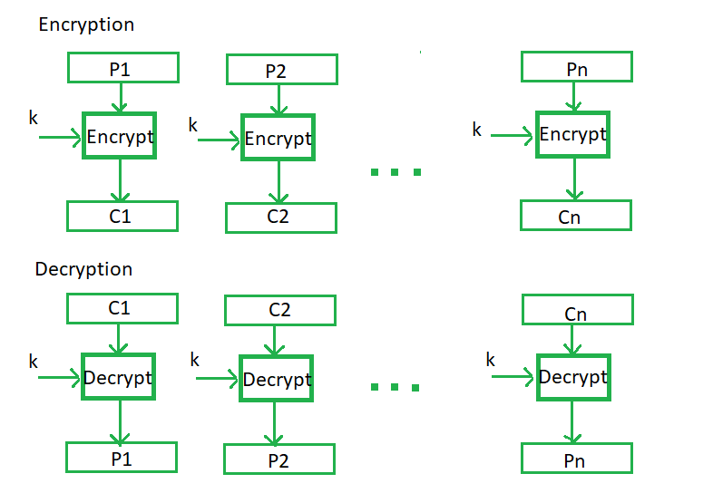
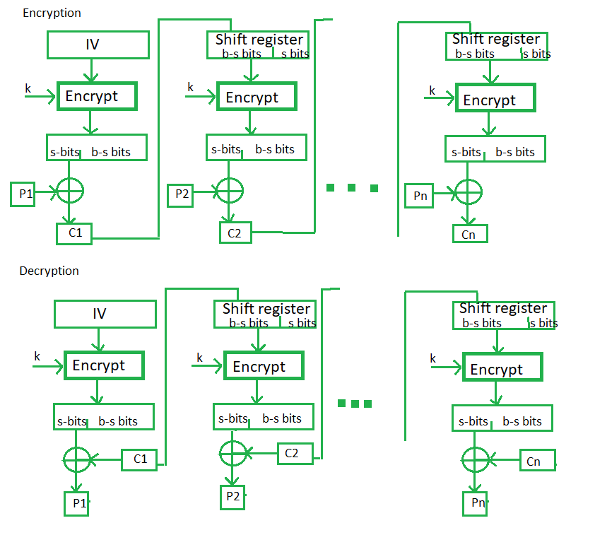
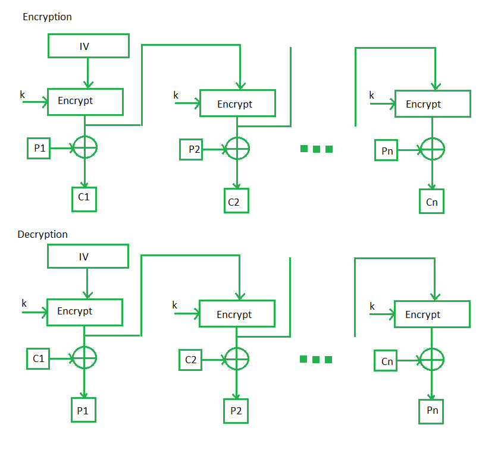
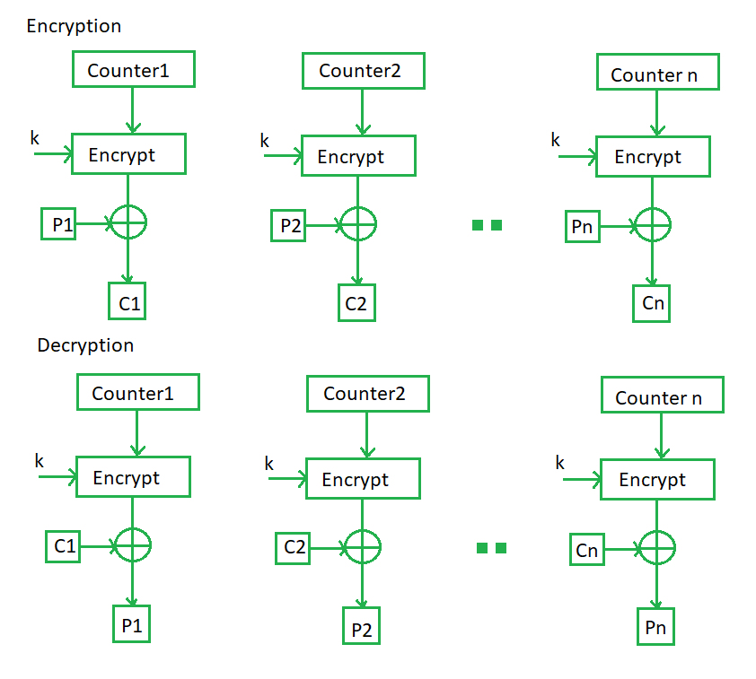

# Unit 2

## Block Cipher Principles

1. **Number of Rounds**: It just reflects the number of rounds to be suitable for an algorithm to make it more complex, in DES we have 16 rounds ensuring it to be more secure while in AES we have 10 rounds which makes it more secure.

2. **Design of function F**: More complex the round function, more stronger the algorithim is.

3. **Confusion and Diffusion**: The cipher should provide confusion and diffusion to make it difficult for an attacker to determine the relationship between the plaintext and ciphertext.

4. **Key Size**: The key size should be large enough to prevent brute-force attacks. A larger key size means that there are more possible keys, making it harder for an attacker to guess the correct one. A key size of 128 bits is considered to be secure for most applications.

5. **Key Schedule**: The key schedule should be designed carefully to ensure that the keys used for encryption are independent and unpredictable. The key schedule should also resist attacks that exploit weak keys or key-dependent properties of the cipher.

6. **Block Size**: The block size should be large enough to prevent attacks that exploit statistical patterns in the plaintext. A block size of 128 bits is generally considered to be secure for most applications.

7. **Non-linearity**: The S-box used in the cipher should be non-linear to provide confusion. A linear S-box is vulnerable to attacks that exploit the linear properties of the cipher.

8. **Avalanche Effect**: The cipher should exhibit the avalanche effect, which means that a small change in the plaintext or key should cause a significant change in the ciphertext. This ensures that any change in the input results in a complete change in the output.

9. **Security Analysis**: The cipher should be analyzed for its security against various attacks such as differential cryptanalysis, linear cryptanalysis, and brute-force attacks. The cipher should also be tested for its resistance to implementation attacks, such as side-channel attacks.

## Confusion and Diffusion

In cryptography, confusion and diffusion are two properties of the operation of a secure cipher.

The confusion technique assures that the ciphertext has no information about the plaintext. The confusion technique keeps the relationship between the **_encrypted text's statistics_** and the **_encryption key's value_** as complex as possible.

In diffusion, the output bits must be highly dependent on the input bits so that if the plaintext is modified by only one bit, the ciphertext must change in an **_unanticipated_** or **_unreliable_** way.

|S.NO|Confusion|Diffusion|
|---|---|---|
|1.|Confusion is a cryptographic technique that is used to create faint cipher texts.|Diffusion is used to create cryptic plain texts.|
|2.|Confusion is possible through substitution algorithms.|Diffusion is possible through transposition algorithms.|
|3.|In confusion, if one bit within the secret is modified, most or all bits within the cipher text also will be modified.|In diffusion, if one image within the plain text is modified, many or all image within the cipher text also will be modified|
|4.|In confusion, vagueness is increased in resultant.|In diffusion, redundancy is increased in the resultant.|
|5.|Both stream cipher and block cipher use confusion. |Only block cipher use diffusion.|
|6.|The relation between the cipher text and the key is masked by confusion.|The relation between the cipher text and the plain text is masked by diffusion.|

## Block Cipher Modes of Operations

### ECB



ECB stands for Electronic Code Block.

###### Advantages

- Simple
- Parallel

###### Disadvantages

- Prone to cryptanalysis since there is a direct relationship between plaintext and ciphertext.

### CBC



CBC stands for Cipher Block Chaining.

###### Advantages

- CBC works well for input greater than _b_ bits.
- CBC is a good authentication mechanism.
- Better resistive nature towards cryptanalysis than ECB.

###### Disadvantages

- Parallel encryption is not possible since every encryption requires a previous cipher.

### CFB


CFB stands for Cipher Feedback Mode

###### Advantages

- Since, there is some data loss due to the use of shift register, thus it is difficult for applying cryptanalysis.

###### Disadvantages

- The drawbacks of CFB are the same as those of CBC mode. Both block losses and concurrent encryption of several blocks are not supported by the encryption. Decryption, however, is parallelizable and loss-tolerant.

### OFB



OFB stands for Output Feedback Mode.

###### Advantages

- In the case of CFB, a single bit error in a block is propagated to all subsequent blocks. This problem is solved by OFB as it is free from bit errors in the plaintext block.

###### Disadvantages

- The drawback of OFB is that, because to its operational modes, it is more susceptible to a message stream modification attack than CFB.

### CTR



CTR stands for Counter.

###### Advantages

- Since there is a different counter value for each block, the direct plaintext and ciphertext relationship is avoided. This means that the same plain text can map to different ciphertext.
- Parallel execution of encryption is possible as outputs from previous stages are not chained as in the case of CBC.

###### Disadvantages

- The fact that CTR mode requires a synchronous counter at both the transmitter and the receiver is a severe drawback. The recovery of plaintext is erroneous when synchronisation is lost.

## Key Distribution

The public key can be distributed in four ways:

1. Public announcement
2. Publicly available directory
3. Public-key authority
4. Public-key certificates. 

###### Public Announcement

Here the public key is broadcasted to everyone. The major weakness of this method is a forgery. Anyone can create a key claiming to be someone else and broadcast it. Until forgery is discovered can masquerade as claimed user. 

###### Publicly Available Directory

In this type, the public key is stored in a public directory. Directories are trusted here, with properties like Participant Registration, access and allow to modify values at any time, contains entries like {name, public-key}. Directories can be accessed electronically still vulnerable to forgery or tampering. 

###### Public Key Authority

It is similar to the directory but, improves security by tightening control over the distribution of keys from the directory. It requires users to know the public key for the directory. Whenever the keys are needed, real-time access to the directory is made by the user to obtain any desired public key securely. 

###### Public Certification

This time authority provides a certificate (which binds an identity to the public key) to allow key exchange without real-time access to the public authority each time. The certificate is accompanied by some other info such as period of validity, rights of use, etc. All of this content is signed by the private key of the certificate authority and it can be verified by anyone possessing the authority’s public key.   
First sender and receiver both request CA for a certificate which contains a public key and other information and then they can exchange these certificates and can start communication.

## PRNG

PRNG stands for Pseudo Random Number Generator.

It refers to an algorithm that uses mathematical formulas to produce sequences of random numbers.

A PRNG starts from an arbitrary starting state using a seed state.

### Linear Congruence Method

```
Xn+1 = (a * Xn + c) mod m
```

where `X` is the sequence of pseudo-random values

```
m: modulus (0 < m)
a: multiplier (0 < a < m)
c: increment (0 ? c < m)
x0: seed value (0 ? x0 < m)
```

### Blum Blum Slub Method

```
Xn+1 = (Xn)^2 mod N
```

Select 2 numbers `p` and `q` such that, dividing them both with `4` gives a remainder of `3`.

For example, `p` = `7` and `q` = `11`.

So `N` = `pq` = `7 * 11` = `77`.

Now choose a number `S` which is prime to both `p` and `q`.

For example, `S` = `12`.

So `X0 = S^2 mod N`.