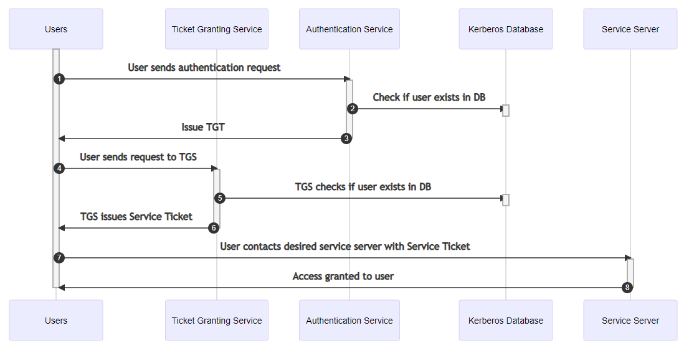
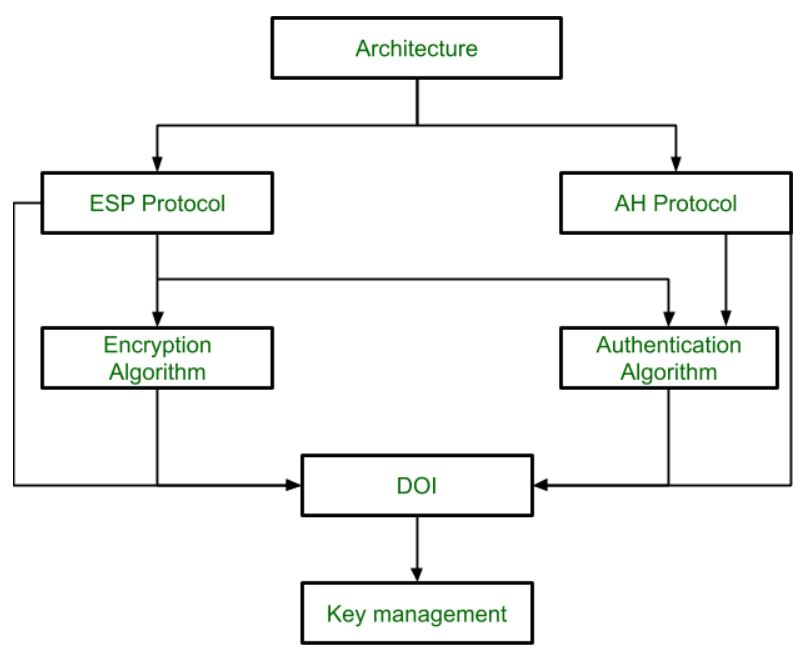
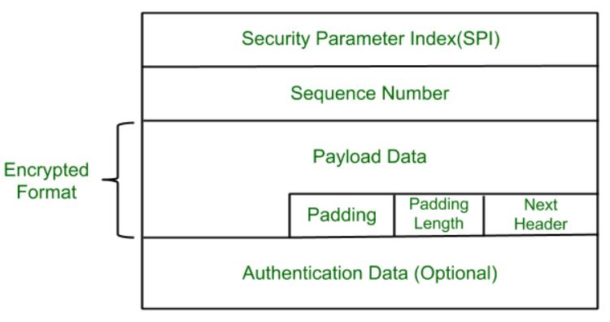
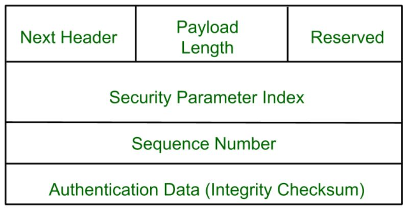

# Unit 4

## Kerberos

The protocol was initially developed by MIT in the 1980s and was named after the mythical three-headed dog who guarded the underworld, Cerberus.

SSO - Single Sign On.

Works on symmetric key cryptography.

It provides a centralized authentication server whose function is to authenticate users to servers and servers to users.

Kerberos Authentication server and database is used for client authentication. Kerberos runs as a third-party trusted server known as the Key Distribution Center (KDC). Each user and service on the network is a principal.

The KDC consists of:
 
- **Authentication Server (AS)**
    
    The Authentication Server performs the initial authentication and ticket for Ticket Granting Service.

- **Ticket Granting Server (TGS)**
    
    The Ticket Granting Server issues the ticket for the Server

- **Database**
    
    The Authentication Server verifies the access rights of users in the database.

### Process

- **Step 1**
    
    User sends its authentication details to the authenticaton server. 
    
    Authentication server authenticates the user using the database.
    
    If the user is authenticated, the server sends TGT and TGS session key back to the user.

- **Step 2**
    
    Uses sends the TGT, TGS session key and the id of the service requested to the TGS.
    
    TGS again authenticates the user and the ticket using the database.
    
    If the user's information is authenticated, TGS sends a service key and serivce session key back to the user.

- **Step 3**
    
    User then sends the service key and serivce session key to the resource server.
    
    The resource server then sends user the resources it requested.

### Advantages

- only Single Sign On required

- **Access Control:** The Kerberos authentication protocol permits powerful access control. Users advantage of a single point for track of all logins and the enforcement of protection policies.  
- **Mutual Authentication:** Kerberos authentication permits carrier structures and customers to authenticate each other. During all steps of the process, the user and the server will understand that the counterparts that they may be interacting with are authentic.
- **Limited Ticket Lifetime:** Each ticket in Kerberos has timestamps and lifelong data, and the period of authentication is managed through admins.  
- **Reusable Authentication:** Kerberos authentication is durable and reusable. Each user will effectively be tested through the system once.  
- **Security:** Multiple secret keys, third-party authorization, and cryptography make Kerberos a secure verification protocol. Passwords are not sent over the networks, and secret keys are encrypted, making it hard for attackers to impersonate users or services. 
- **Performance:** With respect to the Performance, Kerberos keeps track of client information after verification. This means it can do better than NTLM, especially on large farms. Also, Kerberos can transfer client information from an end-to-end webserver to other background servers such as SQL Server.

### Limitations

- Each network service must be modified individually for use with Kerberos.
- It doesn’t work well in a timeshare environment.
- Secured Kerberos Server required.
- Requires an always-on Kerberos server.
- Stores all passwords are encrypted with a single key.
- Assumes workstations are secure.
- May result in cascading loss of trust.
- Scalability.

### Applications

- **User Authentication**
    
    User Authentication is one of the main applications of Kerberos. Users only have to input their username and password once with Kerberos to gain access to the network.

- **Single Sign-On (SSO)**
    
    Kerberos offers a Single Sign-On (SSO) solution that enables users to log in once to access a variety of network resources.
    
    A user can access any network resource they have been authorized to use after being authenticated by the Kerberos server without having to provide their credentials again. 

- **Mutual Authentication**
    
    Before any data is transferred, Kerberos uses a mutual authentication technique to make sure that both the client and server are authenticated. Using a shared secret key that is securely kept on both the client and server, this is accomplished. A client asks the Kerberos server for a service ticket whenever it tries to access a network resource. The client must use its shared secret key to decrypt the challenge that the Kerberos server sends via encryption. If the decryption is successful, the client responds to the server with evidence of its identity.
- **Authorization**: Kerberos also offers a system for authorization in addition to authentication. After being authenticated, a user can submit service tickets for certain network resources. Users can access just the resources they have been given permission to use thanks to information about their privileges and permissions contained in the service tickets. 
- **Network Security**: Kerberos offers a central authentication server that can regulate user credentials and access restrictions, which helps to ensure network security. In order to prevent unwanted access to sensitive data and resources, this server may authenticate users before granting them access to network resources.

### Is Kerberos Infallible?

No security measure is 100% impregnable, and Kerberos is no exception. Because it’s been around for so long, hackers have had the ability over the years to find ways around it, typically through forging tickets, repeated attempts at password guessing (brute force/credential stuffing), and the use of malware, to downgrade the encryption.  

Despite this, Kerberos remains the best access security protocol available today. The protocol is flexible enough to employ stronger encryption algorithms to combat new threats, and if users employ good password-choice guidelines, you shouldn’t have a problem!

### Benefits of Kerberos

Kerberos provides several benefits over previous authentication technologies, such as:

- Plaintext passwords are never sent to the KDC
- Simple transparency and auditing of all events
- Verification against the KDC happens only once for the lifetime of the ticket
- Single sign-on is one of the biggest direct benefits of Kerberos, allowing a user to enter their credentials once, and continue to renew their ticket without intervention
- Support for Multifactor Authentication (MFA)
- Both ends of the communication chain must be authenticated

## IP Security

IP Sec (Internet Protocol Security) is an Internet Engineering Task Force (IETF) standard suite of protocols between two communication points across the IP network that provide data authentication, integrity, and confidentiality.

### Architecture

It covers the general concepts, definitions, protocols, algorithms, and security requirements of IP Security technology. 

###### ESP Protocol

ESP stands for Encapsulation Security Payload.

It provides a confidentiality service.

ESP is implemented in either two ways:

- ESP with optional Authentication.
- ESP with Authentication.

**Packet Format:**

- **Security Parameter Index(SPI):** This parameter is used by Security Association. It is used to give a unique number to the connection built between the Client and Server.
- **Sequence Number:** Unique Sequence numbers are allotted to every packet so that on the receiver side packets can be arranged properly.
- **Payload Data:** Payload data means the actual data or the actual message. The Payload data is in an encrypted format to achieve confidentiality.
- **Padding:** Extra bits of space are added to the original message in order to ensure confidentiality. Padding length is the size of the added bits of space in the original message.
- **Next Header:** Next header means the next payload or next actual data.
- **Authentication Data** This field is optional in ESP protocol packet format.
###### Encryption algorithm

The encryption algorithm is the document that describes various encryption algorithms used for ESP.

###### AH Protocol

AH stands for Authentication Header.

It provides both Authentication and Integrity service.

AH is implemented in one way only: Authentication along with Integrity.

**Packet Format:**

###### Authentication Algorithm

The authentication Algorithm contains the set of documents that describe the authentication algorithm used for AH and for the authentication option of ESP. 

###### DOI (Domain of Interpretation)

DOI is the identifier that supports both AH and ESP protocols. It contains values needed for documentation related to each other.

###### Key Management

Key Management contains the document that describes how the keys are exchanged between sender and receiver.

## MIME

MIME stands Multipurpose Internet Mail Extension.

It is a standard that was proposed by Bell Communications in 1991 in order to expand the limited capabilities of email.

MIME is an add-on that allows non-ASCII data to be sent through SMTP.

It can also be used with other protocols like, POP, IMAP.

### Why MIME was needed?

MIME was needed due to the following limitations of SMTP:

1. SMTP can only send the NVT 7 bit ascii text messages.

2. SMTP cannot send other media types.

3. SMTP cannot be used for non ascii languages, like french, chinese.

4. SMTP is very simple and cannot handle other complex requirements.

### Features of MIME

1. It is able to send multiple attachments with a single message.

2. Unlimited message length.

3. Binary attachments (executables, images, audio, or video files) may be divided if needed.

### MIME Header

It is added to the original e-mail header section to define transformation.

There are __five headers__ that we add to the original header: 

1. **MIME-Version**
    
    Defines the version of the MIME protocol. It must have the parameter __Value 1.0__, which indicates that message is formatted using MIME.

2. **Content-Type**
    
    Type of data used in the body of the message. They are of different types like text data (plain, HTML), audio content, or video content.

3. **Content-Type Encoding**
    
    It defines the method used for encoding the message. Like 7-bit encoding, 8-bit encoding, etc.

4. **Content Id**
    
    It is used for uniquely identifying the message.

6. **Content description**
    
    It defines whether the body is actually an image, video, or audio.

## S/MIME

S/MIME stands Secure Multipurpose Internet Mail Extension.

It is an extension of MIME protococl.

S/MIME encrypts and digitally signs emails to verify that they are verified and that their contents have not been tampered with.

It provides 2 services:

- digital signature
- message encryption

It provides:

- authentication
- non repudiation
- data integrity
- privacy
- data security