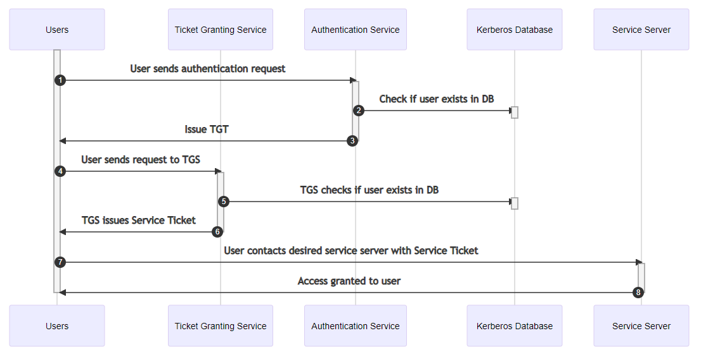

# Unit 4

## Kerberos

The protocol was initially developed by MIT in the 1980s and was named after the mythical three-headed dog who guarded the underworld, Cerberus.

SSO - Single Sign On.

Works on symmetric key cryptography.

It provides a centralized authentication server whose function is to authenticate users to servers and servers to users.

Kerberos Authentication server and database is used for client authentication. Kerberos runs as a third-party trusted server known as the Key Distribution Center (KDC). Each user and service on the network is a principal.

The KDC consists of:
 
- **Authentication Server (AS)**
    
    The Authentication Server performs the initial authentication and ticket for Ticket Granting Service.
     
- **Database:**   
    The Authentication Server verifies the access rights of users in the database.   
     
- **Ticket Granting Server (TGS):**   
    The Ticket Granting Server issues the ticket for the Server

### Overview

- **Step 1**
    
    User login and request services on the host. Thus user requests for ticket-granting service.   
    
- **Step 2**
    
    Authentication Server verifies user’s access right using database and then gives ticket-granting-ticket and session key. Results are encrypted using the Password of the user.   
    
- **Step 3**
    
    The decryption of the message is done using the password then send the ticket to Ticket Granting Server. The Ticket contains authenticators like user names and network addresses.   
    
- **Step 4**
    
    Ticket Granting Server decrypts the ticket sent by User and authenticator verifies the request then creates the ticket for requesting services from the Server.   
    
- **Step 5**
    
    The user sends the Ticket and Authenticator to the Server.   
    
- **Step 6**
    
    The server verifies the Ticket and authenticators then generate access to the service. After this User can access the services.

### Advantages

- only Single Sign On required

- **Access Control:** The Kerberos authentication protocol permits powerful access control. Users advantage of a single point for track of all logins and the enforcement of protection policies.  
- **Mutual Authentication:** Kerberos authentication permits carrier structures and customers to authenticate each other. During all steps of the process, the user and the server will understand that the counterparts that they may be interacting with are authentic.
- **Limited Ticket Lifetime:** Each ticket in Kerberos has timestamps and lifelong data, and the period of authentication is managed through admins.  
- **Reusable Authentication:** Kerberos authentication is durable and reusable. Each user will effectively be tested through the system once.  
- **Security:** Multiple secret keys, third-party authorization, and cryptography make Kerberos a secure verification protocol. Passwords are not sent over the networks, and secret keys are encrypted, making it hard for attackers to impersonate users or services. 
- **Performance:** With respect to the Performance, Kerberos keeps track of client information after verification. This means it can do better than NTLM, especially on large farms. Also, Kerberos can transfer client information from an end-to-end webserver to other background servers such as SQL Server.
### Limitations

- Each network service must be modified individually  for use with Kerberos
- It doesn’t work well in a timeshare environment
- Secured Kerberos Server
- Requires an always-on Kerberos server
- Stores all passwords are encrypted with a single key
- Assumes workstations are secure
- May result in cascading loss of trust.
- Scalability

### Applications

**User Authentication**

User Authentication is one of the main applications of Kerberos. Users only have to input their username and password once with Kerberos to gain access to the network. The Kerberos server subsequently receives the encrypted authentication data and issues a ticket granting ticket (TGT).

**Single Sign-On (SSO)**

Kerberos offers a Single Sign-On (SSO) solution that enables users to log in once to access a variety of network resources. A user can access any network resource they have been authorized to use after being authenticated by the Kerberos server without having to provide their credentials again. 
- **Mutual Authentication**: Before any data is transferred, Kerberos uses a mutual authentication technique to make sure that both the client and server are authenticated. Using a shared secret key that is securely kept on both the client and server, this is accomplished. A client asks the Kerberos server for a service ticket whenever it tries to access a network resource. The client must use its shared secret key to decrypt the challenge that the Kerberos server sends via encryption. If the decryption is successful, the client responds to the server with evidence of its identity. 
- **Authorization**: Kerberos also offers a system for authorization in addition to authentication. After being authenticated, a user can submit service tickets for certain network resources. Users can access just the resources they have been given permission to use thanks to information about their privileges and permissions contained in the service tickets. 
- **Network Security**: Kerberos offers a central authentication server that can regulate user credentials and access restrictions, which helps to ensure network security. In order to prevent unwanted access to sensitive data and resources, this server may authenticate users before granting them access to network resources.

### Is Kerberos Infallible?

No security measure is 100% impregnable, and Kerberos is no exception. Because it’s been around for so long, hackers have had the ability over the years to find ways around it, typically through forging tickets, repeated attempts at password guessing (brute force/credential stuffing), and the use of malware, to downgrade the encryption.  

Despite this, Kerberos remains the best access security protocol available today. The protocol is flexible enough to employ stronger encryption algorithms to combat new threats, and if users employ good password-choice guidelines, you shouldn’t have a problem!