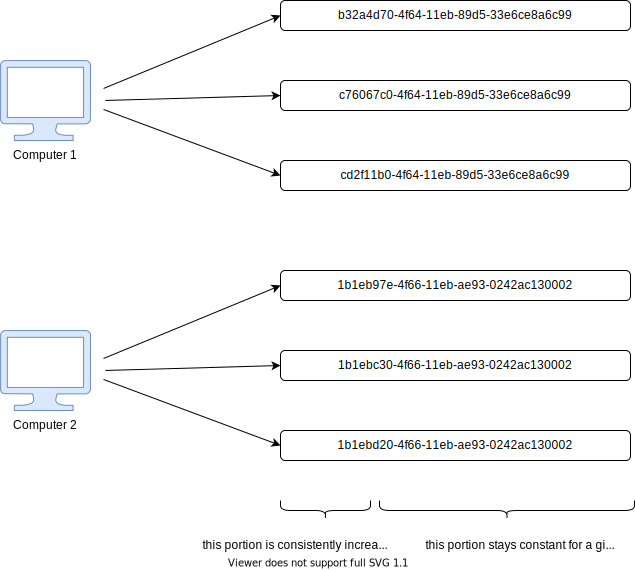

---
aliases:
  - guid
todo: add v2 and v3
---

# UUID

UUID stands for Universally unique identifier.

Also known as GUID in Microsoft systems.

## V1 : Uniqueness

UUID v1 is generated by using a combination the host computers MAC address and the current date and time.

In addition to this, it also introduces another random component just to be sure of its uniqueness.

This means you are guaranteed to get a completely unique ID, unless you generate it from the _same_ computer, and at the exact _same_ time.

In that case, the chance of collision changes from impossible to very very small because of the random bits.

This guaranteed uniqueness comes at the cost of anonymity. Because UUID v1 takes the time and your MAC address into consideration, this also means that someone could potentially identify the time and place(i.e.  
computer) of creation.

## V4 : Randomness

The generation of a v4 UUID is much simpler to comprehend.

The bits that comprise a UUID v4 are generated randomly and with no inherent logic.

Because of this, there is no way to identify information about the  
source by looking at the UUID.

However, there is now a chance that a UUID could be duplicated. The question is, do you need to worry about it?

The short answer is no. With the sheer number of possible combinations  
(2^128), it would be almost impossible to generate a duplicate unless  
you are generating trillions of IDs every second, for many years.

If your application is mission critical (for example, bank transactions or medical systems), you should still add a uniqueness constraint to avoid UUIDv4 collision

## V5: Non-Random UUIDs

If you want a unique ID that’s not random, UUID v5 could be the right choice.

Unlike v1 or v4, UUID v5 is generated by providing two pieces of input information:

1. **Input string:** Any string that can change in your application.

2. **Namespace:** A fixed UUID used in combination with the input string to differentiate between UUIDs generated in different applications, and to prevent [rainbow table hacks](https://www.hackingloops.com/what-are-rainbow-tables/)

These two pieces of information are converted to a UUID using the SHA1 hashing algorithm.

## References

- https://www.sohamkamani.com/uuid-versions-explained
