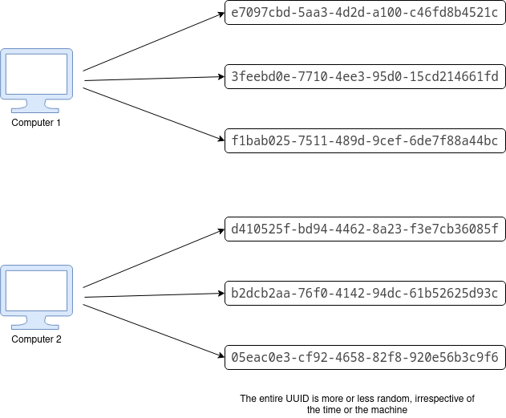

# UUID V4

The generation of a v4 UUID is much simpler to comprehend.

The bits that comprise a UUID v4 are generated randomly and with no inherent logic.

Because of this, there is no way to identify information about the  
source by looking at the UUID.

However, there is now a chance that a UUID could be duplicated. The question is, do you need to worry about it?

The short answer is no. With the sheer number of possible combinations  
(2^128), it would be almost impossible to generate a duplicate unless  
you are generating trillions of IDs every second, for many years.

If your application is mission critical (for example, bank transactions or medical systems), you should still add a uniqueness constraint to avoid UUIDv4 collision

## References

